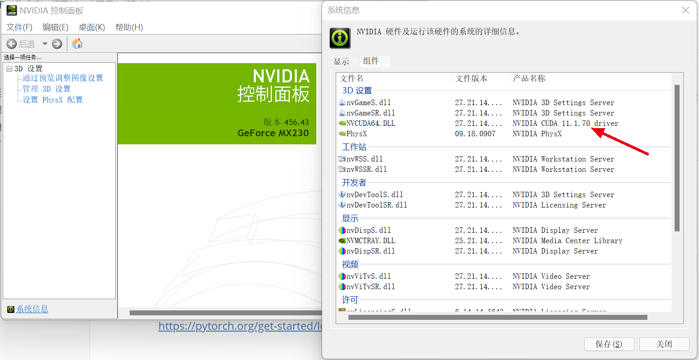
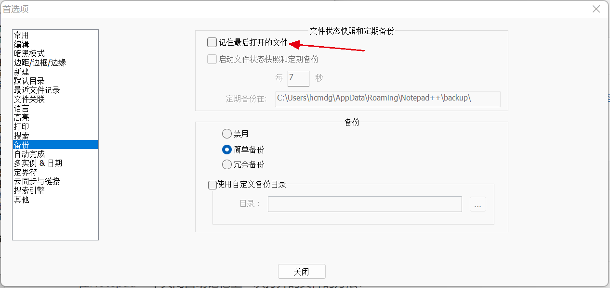

# 0 简介

本文档旨在记录对于全新安装的Win、Mac系统，如何配置环境。

# 1 软件列表

| 软件名        | 类别 | 下载方式                                                     | Win  | Mac  | 备注                                        |
| ------------- | ---- | ------------------------------------------------------------ | ---- | ---- | ------------------------------------------- |
| Typora        | 开发 | [GitHub](./安装包/Typora)                                    | √    | √    | >=1.0版本收费。                             |
| Edge          | 必备 | Store                                                        | √    | √    |                                             |
| 搜狗输入法    | 必备 | [官网](https://pinyin.sogou.com/)                            | √    | √    |                                             |
| VS Code       | 开发 | [官网](https://code.visualstudio.com/)                       | √    | √    |                                             |
| Git           | 开发 | [官网](https://git-scm.com/)                                 | √    | √    | Git配置参见第5节。                          |
| Anaconda      | 开发 | [清华源](https://mirrors.tuna.tsinghua.edu.cn/anaconda/)     | √    | √    | Conda和Pip源配置参见第3节。                 |
| WPS           | 必备 | [官网](https://www.wps.cn/)                                  | √    | √    |                                             |
| PyTorch       | 开发 | [官网](https://pytorch.org/get-started/locally/)             | √    | √    | PyTorch安装指南参见第4节。                  |
| 微信          | 必备 | [官网](https://pc.weixin.qq.com/)                            | √    | √    |                                             |
| Everything    | 必备 | [官网](https://www.voidtools.com/zh-cn/)                     | √    | ×    |                                             |
| 有道云笔记    | 必备 | [官网](https://note.youdao.com/)                             | √    | √    |                                             |
| 有道词典      | 必备 | [官网](https://www.youdao.com/)                              | √    | √    |                                             |
| Bandizip      | 必备 | [官网](https://www.bandisoft.com/bandizip/)                  | √    | ×    |                                             |
| Notepad++     | 开发 | [官网](https://notepad-plus-plus.org/downloads/)             | √    | ×    | Notepad++配置参见第6节。                    |
| 百度网盘      | 必备 | [官网](https://pan.baidu.com/download)                       | √    | √    |                                             |
| PyCharm       | 开发 | [官网](https://www.jetbrains.com/pycharm/)                   | √    | √    |                                             |
| IDEA          | 开发 | [官网](https://www.jetbrains.com/idea/)                      | √    | √    |                                             |
| DataGrip      | 开发 | [官网](https://www.jetbrains.com/datagrip/)                  | √    | √    |                                             |
| QQ音乐        | 必备 | [官网](https://y.qq.com/)                                    | √    | √    |                                             |
| 完美解码      | 必备 | [官网](https://jm.wmzhe.com/)                                | √    | ×    |                                             |
| 格式工厂      | 必备 | [官网](http://www.pcgeshi.com/)                              | √    | ×    |                                             |
| 腾讯会议      | 必备 | [官网](https://meeting.tencent.com/download-center.html)     | √    | √    |                                             |
| Java SE 8     | 开发 | [GitHub](./安装包/JavaSE)                                    | √    | √    | 提供的安装包只适用于Win，需要配置环境变量。 |
| EV录屏        | 必备 | [官网](https://www.ieway.cn/evcapture.html)                  | √    | √    |                                             |
| 花生壳        | 开发 | [官网](https://hsk.oray.com/download/)                       | √    | √    |                                             |
| XSHELL & XFTP | 开发 | [官网](https://www.xshell.com/zh/free-for-home-school/) [GitHub](./安装包/XSHELL&XFTP) | √    | ×    |                                             |

# 2 Windows系统常用配置

## 2.1 Win11显示完整右键菜单

Win11在文件夹中右键，默认显示简化的快捷菜单，如果要恢复完整右键菜单，可以参考以下文章。

有没有什么办法可以让win11右键默认显示更多选项？ - 太平洋电脑网的回答 - 知乎 https://www.zhihu.com/question/480356710/answer/2204452858

# 3 Conda和Pip源配置

Conda源配置：https://mirrors.tuna.tsinghua.edu.cn/help/anaconda/

Pip源配置：https://mirrors.tuna.tsinghua.edu.cn/help/pypi/

# 4 PyTorch安装指南

对于Windows系统，可以在NVIDIA控制面板中选择“帮助->系统信息”，查看“组件”，即可查看CUDA版本。

然后使用官网的Conda方式安装即可：

https://pytorch.org/get-started/locally/



# 5 Git配置

## 5.1 设置用户名和邮箱

安装完Git后，使用如下命令设置用户名和邮箱：

```
git config --global user.name "Your Name"
git config --global user.email "email@example.com"
```

## 5.2 生成SSH key

参考如下指南生成SSH key：https://docs.github.com/en/authentication/connecting-to-github-with-ssh/generating-a-new-ssh-key-and-adding-it-to-the-ssh-agent

执行命令：

```
ssh-keygen -t ed25519 -C "your_email@example.com"
```

然后将用户目录下.ssh/xx.pub文件的内容添加到GitHub的相应设置里即可。

## 5.3 显示中文路径

执行如下命令：

```
git config --global core.quotepath false
```

# 6 Notepad++配置

在Notepad++中关闭自动记忆上一次打开的文件的方法：

设置->首选项->备份->记住最后打开的文件。


